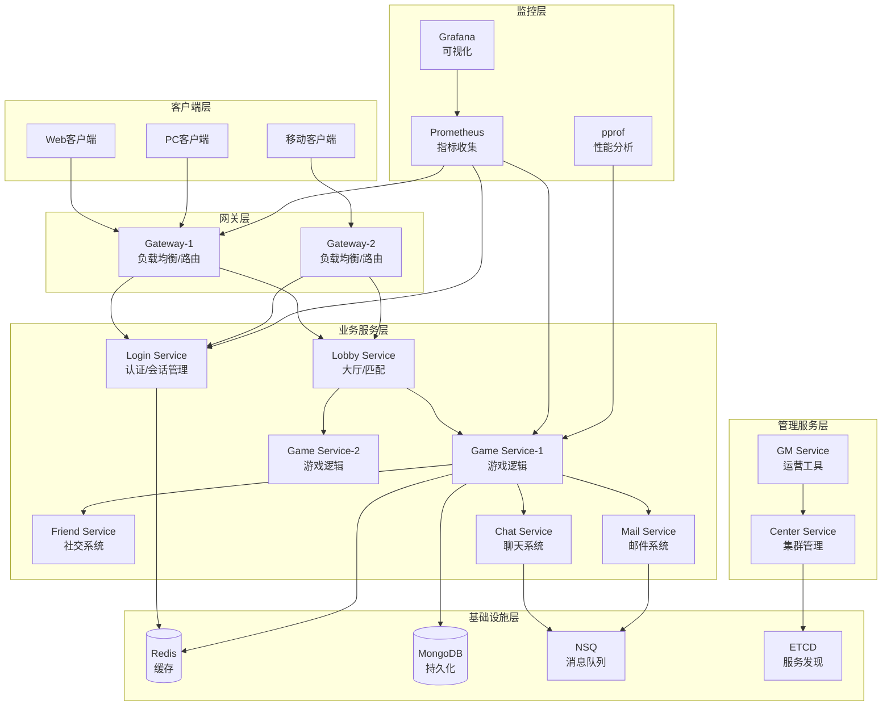

# Lufy 分布式游戏服务器框架 🎮

Lufy 是一个**企业级**的分布式游戏服务器框架，专为炉石传说、皇室战争、万智牌等卡牌和策略类游戏设计。框架基于 Actor 模型构建，具备生产级的高并发、安全性、监控能力和热更新机制。

[](https://golang.org)
[](LICENSE)
[]()
[]()

## 🚀 核心特性

### 🏗️ 基础架构
- **Actor 模型**: 基于 Actor 模型的并发处理，支持消息驱动的异步编程
- **分布式架构**: 支持多节点部署，可横向扩展至数千台服务器
- **服务发现**: 基于 ETCD 的自动服务发现和注册，支持故障自愈
- **高性能网络**: TCP 协议 + Protobuf 序列化，支持百万级并发连接
- **RPC 通信**: 内置高性能 RPC 框架，支持连接池和负载均衡
- **消息队列**: 集成 NSQ 消息队列，支持异步消息处理和事件驱动

### 💾 数据和存储
- **数据存储**: Redis 集群（6节点）+ MongoDB 副本集（3节点）
- **高可用部署**: 支持Redis哨兵、MongoDB副本集、分片集群
- **对象池**: 智能对象池系统，显著降低 GC 压力
- **数据一致性**: 分布式事务支持，保证数据一致性
- **缓存策略**: 多级缓存机制，提升数据访问性能
- **故障转移**: 自动主从切换，零停机时间

### 🔥 热更新系统
- **配置热更新**: 无需重启即可更新游戏配置
- **逻辑热更新**: 支持游戏逻辑模块的动态加载
- **插件系统**: 基于 Go Plugin 的热插拔模块架构
- **版本控制**: 安全的热更新版本管理和回滚机制

### 📊 监控和分析
- **Prometheus 集成**: 完整的指标收集和监控体系，支持集群监控
- **Zap 高性能日志**: 结构化日志记录，支持高并发和采样
- **pprof 性能分析**: 内置性能分析工具，支持 CPU/内存/Goroutine 分析
- **实时告警**: 智能告警系统，支持多种通知渠道
- **性能可视化**: Grafana 仪表板，实时可视化集群性能数据
- **集群拓扑**: 自动发现和可视化集群拓扑结构

### 🔐 安全增强
- **多层安全防护**: JWT 认证 + 会话管理 + IP 黑名单
- **反作弊系统**: 智能作弊检测和行为分析
- **数据加密**: AES-GCM 加密算法保护敏感数据
- **限流保护**: 多维度限流机制，防止恶意攻击

### 🌍 国际化支持
- **多语言支持**: 内置中英日韩等语言包
- **动态语言切换**: 客户端可动态切换显示语言
- **本地化格式**: 数字、货币、时间的本地化显示
- **翻译管理**: 便捷的翻译更新和版本管理

### 🎪 玩法扩展
- **游戏模块化**: 支持多种游戏玩法的模块化开发
- **卡牌系统**: 内置完整的卡牌游戏框架
- **房间管理**: 灵活的游戏房间创建和管理
- **AI 系统**: 支持游戏 AI 的集成和扩展

## 📋 系统要求

### 必需组件
- Go 1.21+
- Redis 6.0+
- MongoDB 4.4+
- ETCD 3.5+
- NSQ 1.2+

### 可选组件
- Docker & Docker Compose（用于快速部署）

## 🏗️ 系统架构

### 整体架构图



### 技术栈组件

| 组件类型 | 技术选型 | 用途说明 |
|----------|----------|----------|
| **编程语言** | Go 1.21+ | 高性能、并发友好 |
| **通信协议** | TCP + Protobuf | 高效二进制协议 |
| **并发模型** | Actor Model | 消息驱动的异步处理 |
| **服务发现** | ETCD | 分布式配置和服务注册 |
| **缓存系统** | Redis | 高速数据缓存 |
| **数据库** | MongoDB | 文档型数据库 |
| **消息队列** | NSQ | 轻量级消息队列 |
| **监控系统** | Prometheus + Grafana | 指标收集和可视化 |
| **性能分析** | pprof | Go 原生性能分析 |
| **容器化** | Docker + Docker Compose | 容器化部署 |

## 🎯 服务节点

| 服务 | 说明 | TCP端口 | RPC端口 | 监控端口 | 核心职责 |
|------|------|---------|---------|----------|----------|
| **Gateway** | 网关服务 | 8001-8002 | 9001-9002 | 7001-7002 | 客户端接入、消息路由、负载均衡、安全验证 |
| **Login** | 登录服务 | - | 9020 | 7020 | 用户认证、JWT令牌、会话管理、安全检查 |
| **Lobby** | 大厅服务 | - | 9030 | 7030 | 房间管理、匹配系统、游戏模式选择 |
| **Game** | 游戏服务 | - | 9100-9102 | 7100-7102 | 游戏逻辑、AI系统、热更新模块 |
| **Enhanced Game** | 增强游戏服务 | - | 9103-9105 | 7103-7105 | 包含所有新特性的游戏服务节点 |
| **Friend** | 好友服务 | - | 9040 | 7040 | 好友关系、社交功能、状态同步 |
| **Chat** | 聊天服务 | - | 9050 | 7050 | 聊天系统、消息广播、内容过滤 |
| **Mail** | 邮件服务 | - | 9060 | 7060 | 邮件系统、奖励发放、通知推送 |
| **GM** | 管理服务 | - | 9200 | 7200 | GM工具、运营管理、热更新控制 |
| **Center** | 中心服务 | - | 9010 | 7010 | 集群管理、监控统计、服务协调 |

### 端口分配规则

- **TCP端口 (8xxx)**: 客户端连接端口，主要用于Gateway服务
- **RPC端口 (9xxx)**: 服务间RPC通信端口
- **监控端口 (7xxx)**: HTTP监控接口，提供指标查询和健康检查
- **pprof端口 (8xxx)**: 性能分析端口 = 监控端口 + 1000

## 🚀 快速开始

### 1. 环境检查

使用自动检查脚本验证环境依赖：

```bash
git clone <repository-url> lufy
cd lufy

# 检查所有依赖
chmod +x scripts/*.sh
./scripts/check_deps.sh
```

### 2. Docker 部署方式

#### 2.1 单机部署（开发/测试）

```bash
# 启动单机版本（包括所有依赖服务）
docker-compose up -d

# 查看服务状态
docker-compose ps

# 查看日志
docker-compose logs -f lufy-center
```

#### 2.2 集群部署（生产推荐）

```bash
# 启动高可用集群（Redis集群 + MongoDB副本集 + ETCD集群）
make cluster-up

# 或手动启动
chmod +x scripts/*.sh
./scripts/start_cluster.sh full --with-monitoring

# 快速启动（开发用）
./scripts/start_cluster.sh quick

# 查看集群状态
./scripts/cluster_status.sh

# 实时集群监控
./scripts/cluster_status.sh watch
```

**集群架构包含：**
- **Redis集群**: 6节点（3主3从）
- **MongoDB副本集**: 3节点（1主2从）
- **ETCD集群**: 3节点（高可用）
- **NSQ集群**: 2个Lookup + 3个Daemon
- **应用服务**: 多实例负载均衡
- **负载均衡**: Nginx反向代理

### 3. 本地开发启动

#### 3.1 启动基础依赖

```bash
# 使用 Docker 启动基础设施（推荐）
docker-compose up -d redis mongodb etcd nsqlookupd nsqd

# 或手动启动各个组件
redis-server &
mongod &
etcd &
nsqlookupd &
nsqd --lookupd-tcp-address=127.0.0.1:4160 &
```

#### 3.2 构建和启动游戏服务器

```bash
# 下载Go依赖
go mod tidy

# 构建项目
make build

# 启动基础版游戏服务器
./scripts/start.sh

# 或启动增强版游戏服务器（包含所有新特性）
./scripts/start_enhanced.sh

# 启动增强版 + 完整监控栈
./scripts/start_enhanced.sh --with-monitoring
```

### 4. 验证部署

#### 4.1 检查服务状态

```bash
# 查看所有服务状态
./scripts/status.sh

# 实时监控模式
./scripts/status.sh watch
```

#### 4.2 测试客户端连接

```bash
# 运行测试客户端
go run examples/client/main.go

# 输出示例:
# Connected to server: 127.0.0.1:8001
# Login successful! UserID: 123456, Token: abcd1234...
# Player Info - Nickname: testuser, Level: 1, Gold: 1000, Diamond: 100
```

#### 4.3 访问监控面板

启动完成后，可以访问以下监控面板：

| 服务 | 地址 | 说明 |
|------|------|------|
| **主监控面板** | http://localhost:7001 | 服务健康状况和指标 |
| **pprof 性能分析** | http://localhost:8001/debug/pprof/ | Go 性能分析工具 |
| **Prometheus** | http://localhost:9090 | 指标数据库和查询 |
| **Grafana** | http://localhost:3000 | 可视化仪表板 (admin/admin) |
| **NSQ 管理** | http://localhost:4171 | 消息队列管理 |
| **Redis 管理** | http://localhost:8081 | Redis 数据管理 |
| **MongoDB 管理** | http://localhost:8082 | MongoDB 数据管理 |

### 5. 性能分析

#### 5.1 使用内置分析工具

```bash
# 收集性能指标
go run tools/performance_analyzer.go collect

# 生成 pprof 分析命令
go run tools/performance_analyzer.go pprof

# 实时监控模式
go run tools/performance_analyzer.go watch
```

#### 5.2 pprof 性能分析

```bash
# CPU 性能分析（采集30秒）
go tool pprof http://localhost:8001/debug/pprof/profile?seconds=30

# 内存堆分析
go tool pprof http://localhost:8001/debug/pprof/heap

# Goroutine 分析
go tool pprof http://localhost:8001/debug/pprof/goroutine

# 在 pprof 交互模式中：
(pprof) top          # 查看热点函数
(pprof) web          # 生成调用图
(pprof) list main    # 查看函数代码
```

## ⚙️ 配置说明

主配置文件位于 `config/config.yaml`，包含以下配置项：

### 服务器配置
```yaml
server:
  name: "lufy-game-server"
  version: "1.0.0"
  debug: true
```

### 网络配置
```yaml
network:
  tcp_port: 8001      # TCP服务端口
  rpc_port: 9001      # RPC服务端口
  http_port: 7001     # HTTP管理端口
  max_connections: 10000
  read_timeout: 30
  write_timeout: 30
```

### 数据库配置
```yaml
database:
  redis:
    addr: "127.0.0.1:6379"
    password: ""
    db: 0
    pool_size: 100
  mongodb:
    uri: "mongodb://127.0.0.1:27017"
    database: "lufy_game"
    pool_size: 100
```

## 🔥 热更新系统

Lufy 支持生产级的热更新机制，可在不停服的情况下更新游戏逻辑、配置和数据。

### 热更新类型

| 类型 | 说明 | 影响范围 | 安全级别 |
|------|------|----------|----------|
| **配置更新** | 游戏参数、平衡性调整 | 所有服务 | 🟢 安全 |
| **逻辑更新** | 游戏规则、AI算法 | 游戏服务 | 🟡 谨慎 |
| **数据更新** | 卡牌数据、奖励配置 | 相关服务 | 🟢 安全 |
| **模块更新** | 新功能模块 | 指定服务 | 🔴 高风险 |

### 热更新操作

```bash
# 重载所有节点的配置文件
./scripts/hot_reload.sh config

# 重载游戏节点的逻辑模块
./scripts/hot_reload.sh logic game

# 重载指定节点的特定模块
./scripts/hot_reload.sh module gateway1 auth_module

# 查看热更新状态
./scripts/hot_reload.sh status

# 回滚最近的更新
./scripts/hot_reload.sh rollback game1
```

### 热更新最佳实践

```bash
# 1. 更新前备份配置
cp config/config.yaml config/config.yaml.backup

# 2. 验证配置文件语法
make validate-config

# 3. 在单个节点测试
./scripts/hot_reload.sh config game1

# 4. 确认无误后全量更新
./scripts/hot_reload.sh config all

# 5. 监控系统指标
go run tools/performance_analyzer.go watch
```

## 📊 性能监控与分析

### Prometheus 指标

Lufy 内置了完整的 Prometheus 指标体系：

```bash
# 查看所有指标
curl http://localhost:7001/metrics

# 关键业务指标
curl http://localhost:7001/api/metrics | jq .
```

#### 核心指标说明

```yaml
# 系统指标
lufy_cpu_usage_percent{node_id="game1",node_type="game"}      # CPU使用率
lufy_memory_usage_bytes{node_id="game1",node_type="game"}     # 内存使用量
lufy_goroutines_total{node_id="game1",node_type="game"}       # Goroutine数量

# 网络指标
lufy_connections_total{node_id="gateway1",node_type="gateway"} # 连接数
lufy_request_duration_seconds                                  # 请求延迟

# 业务指标
lufy_messages_total{message_type="user_login"}                # 消息处理量
lufy_errors_total{error_type="login_failed"}                  # 错误统计
lufy_actors_total{node_id="game1",node_type="game"}          # Actor数量
```

### 性能分析工具

#### 自动化分析

```bash
# 收集当前性能快照
go run tools/performance_analyzer.go collect

# 输出示例：
# 📈 集群概览:
#   服务总数: 12
#   平均CPU使用率: 15.2%
#   平均内存使用率: 45.8%
#   总Goroutines: 2847
#   告警总数: 0
#   优化建议: 2条

# 与历史数据对比
go run tools/performance_analyzer.go save baseline.json
# ... 运行一段时间后 ...
go run tools/performance_analyzer.go compare baseline.json
```

#### 手动 pprof 分析

```bash
# 各服务的性能分析端点
go tool pprof http://localhost:8001/debug/pprof/profile   # Gateway
go tool pprof http://localhost:8100/debug/pprof/heap     # Game Server  
go tool pprof http://localhost:8020/debug/pprof/goroutine # Login

# 生成性能报告
go tool pprof -http=:8080 profile.pb.gz  # Web界面查看
go tool pprof -png profile.pb.gz > profile.png  # 生成PNG图片
```

### Grafana 仪表板

访问 http://localhost:3000，使用 admin/admin 登录，预配置的仪表板包括：

1. **集群概览**: 整体健康状况和关键指标
2. **服务详情**: 单个服务的详细监控
3. **业务监控**: 用户登录、游戏活跃度等
4. **告警中心**: 实时告警和历史记录

## 🔐 安全特性

### 认证和授权

```go
// JWT 令牌认证
claims := &TokenClaims{
    UserID:      userID,
    Username:    username,
    Permissions: []string{"player", "premium"},
    StandardClaims: jwt.StandardClaims{
        ExpiresAt: time.Now().Add(24 * time.Hour).Unix(),
    },
}

token, err := security.GenerateToken(claims)
```

### 反作弊系统

```bash
# 查看作弊检测报告
curl http://localhost:7001/api/security

# 手动标记可疑用户
curl -X POST http://localhost:7200/gm/flag_user \
  -d '{"user_id": 123456, "reason": "suspicious_pattern"}'
```

### 安全配置

```yaml
# config/security.yaml
security:
  jwt:
    secret: "your-jwt-secret"
    expires_hours: 24
  
  rate_limit:
    requests_per_minute: 100
    burst_size: 10
  
  blacklist:
    auto_ban_threshold: 10
    ban_duration_hours: 24
  
  encryption:
    algorithm: "aes-gcm"
    key_size: 256
```

## 🌍 国际化配置

### 支持的语言

- 🇺🇸 **English (en)** - 默认语言
- 🇨🇳 **简体中文 (zh-CN)** - 完整支持
- 🇯🇵 **日本語 (ja)** - 基础支持
- 🇰🇷 **한국어 (ko)** - 基础支持

### 语言配置

```bash
# 添加新语言包
mkdir -p locales
echo '[{"id": "welcome", "one": "Welcome to the game!"}]' > locales/en.json

# 更新翻译
curl -X POST http://localhost:7001/api/i18n/update \
  -d '{"lang": "zh-CN", "key": "welcome", "value": "欢迎来到游戏！"}'

# 验证翻译完整性
curl http://localhost:7001/api/i18n/validate
```

### 客户端语言检测

```go
// 自动检测客户端语言偏好
acceptLanguage := "zh-CN,zh;q=0.9,en;q=0.8"
detectedLang := i18nManager.DetectLanguage(acceptLanguage)
// 返回: "zh-CN"

// 格式化本地化消息
message := i18nManager.Translate("zh-CN", "game.your_turn", nil)
// 返回: "轮到你了"
```

## 🎮 客户端接入

### 协议格式

客户端与服务器通信使用 Protobuf 协议，消息格式：

```
[4字节长度][4字节消息ID][Protobuf消息内容]
```

### 消息结构

```protobuf
message BaseRequest {
    MessageHeader header = 1;  // 消息头
    bytes data = 2;           // 消息体
}

message BaseResponse {
    MessageHeader header = 1;  // 消息头
    int32 code = 2;           // 错误码
    string msg = 3;           // 消息内容（已本地化）
    bytes data = 4;           // 响应数据
}

message MessageHeader {
    uint32 msg_id = 1;        // 消息ID
    uint32 seq = 2;           // 序列号
    uint64 user_id = 3;       // 用户ID
    uint32 timestamp = 4;     // 时间戳
    string session_id = 5;    // 会话ID
}
```

### 消息ID规划

| 消息ID范围 | 服务类型 | 说明 |
|-----------|----------|------|
| 1001-1999 | Gateway | 登录、心跳、基础功能 |
| 2001-2999 | Lobby | 大厅、房间管理 |
| 3001-3999 | Game | 游戏逻辑、操作 |
| 4001-4999 | Friend | 好友系统 |
| 5001-5999 | Chat | 聊天功能 |
| 6001-6999 | Mail | 邮件系统 |
| 7001-7999 | GM | 管理功能 |

### 完整登录流程

```go
// 1. 建立TCP连接到网关
conn, err := net.Dial("tcp", "127.0.0.1:8001")

// 2. 构造登录请求
loginReq := &proto.LoginRequest{
    Username: "player1",
    Password: "123456",
    DeviceId: "device_123",
    Platform: "android",
    Version:  "1.0.0",
}

// 3. 封装成基础请求
baseReq := &proto.BaseRequest{
    Header: &proto.MessageHeader{
        MsgId:     1001, // 登录消息ID
        Seq:       1,
        Timestamp: uint32(time.Now().Unix()),
    },
    Data: proto.Marshal(loginReq),
}

// 4. 发送请求并处理响应
response, err := sendRequest(conn, 1001, baseReq)
if err != nil {
    log.Fatal(err)
}

// 5. 解析登录响应
var loginResp proto.LoginResponse
proto.Unmarshal(response.Data, &loginResp)

fmt.Printf("登录成功! 用户ID: %d, 令牌: %s\n", 
    loginResp.UserId, loginResp.Token[:10]+"...")
```

## 🔧 开发指南

### 添加新服务节点

1. **创建服务文件**：`internal/server/your_server.go`
2. **实现Server接口**：包括Start()、Stop()等方法
3. **注册服务类型**：在`NewServer`函数中添加服务类型
4. **更新配置**：添加端口配置和服务参数
5. **更新启动脚本**：添加到启动序列

```go
// internal/server/your_server.go
type YourServer struct {
    *BaseServer
    yourComponent *YourComponent
}

func NewYourServer(configFile, nodeID string) *YourServer {
    baseServer, err := NewBaseServer(configFile, "your_service", nodeID)
    if err != nil {
        logger.Fatal(fmt.Sprintf("Failed to create base server: %v", err))
    }

    yourServer := &YourServer{
        BaseServer: baseServer,
        yourComponent: NewYourComponent(),
    }

    // 注册通用服务
    if err := RegisterCommonServices(baseServer); err != nil {
        logger.Fatal(fmt.Sprintf("Failed to register common services: %v", err))
    }

    return yourServer
}
```

### 添加新的Actor

```go
type YourActor struct {
    *actor.BaseActor
    server     *YourServer
    customData map[string]interface{}
}

func NewYourActor(server *YourServer) *YourActor {
    baseActor := actor.NewBaseActor("your_actor", "your_type", 1000)
    return &YourActor{
        BaseActor:  baseActor,
        server:     server,
        customData: make(map[string]interface{}),
    }
}

func (ya *YourActor) OnReceive(ctx context.Context, msg actor.Message) error {
    // 记录性能指标
    start := time.Now()
    defer func() {
        duration := time.Since(start)
        ya.server.monitoring.RecordRequestDuration("actor", msg.GetType(), duration)
    }()

    switch msg.GetType() {
    case "your_message_type":
        return ya.handleYourMessage(msg)
    case actor.MSG_TYPE_SYSTEM_CMD:
        return ya.handleSystemCommand(msg)
    default:
        logger.Debug(fmt.Sprintf("Unknown message type: %s", msg.GetType()))
    }
    return nil
}

func (ya *YourActor) handleYourMessage(msg actor.Message) error {
    // 实现自定义消息处理逻辑
    ya.server.monitoring.RecordMessage("your_message")
    return nil
}
```

### 添加新的RPC服务

```go
type YourService struct {
    server   *YourServer
    security *security.SecurityManager
    i18n     *i18n.I18nManager
}

func NewYourService(server *YourServer) *YourService {
    return &YourService{
        server:   server,
        security: server.security,
        i18n:     server.i18n,
    }
}

func (ys *YourService) RegisterMethods() map[string]reflect.Value {
    methods := make(map[string]reflect.Value)
    methods["YourMethod"] = reflect.ValueOf(ys.YourMethod)
    methods["SecureMethod"] = reflect.ValueOf(ys.SecureMethod)
    return methods
}

func (ys *YourService) YourMethod(ctx context.Context, req *proto.BaseRequest) (*proto.BaseResponse, error) {
    // 性能监控
    start := time.Now()
    defer func() {
        duration := time.Since(start)
        ys.server.monitoring.RecordRequestDuration("rpc", "YourMethod", duration)
    }()

    // 安全验证
    session, err := ys.validateRequest(req)
    if err != nil {
        return ys.createErrorResponse(req, -1, "error.permission_denied", nil)
    }

    // 业务逻辑处理
    // ...

    // 返回本地化响应
    langCode := ys.detectLanguage(req)
    message := ys.i18n.Translate(langCode, "success.operation_completed", nil)

    return &proto.BaseResponse{
        Header: req.Header,
        Code:   0,
        Msg:    message,
    }, nil
}
```

### 添加新的游戏模块

```go
// plugins/your_game.go
type YourGameModule struct {
    name    string
    version string
    config  map[string]interface{}
}

func NewYourGameModule() *YourGameModule {
    return &YourGameModule{
        name:    "your_game",
        version: "1.0.0",
        config:  make(map[string]interface{}),
    }
}

func (ygm *YourGameModule) Initialize() error {
    // 加载游戏配置
    ygm.config["max_players"] = 4
    ygm.config["turn_time"] = 60
    logger.Info("Your game module initialized")
    return nil
}

func (ygm *YourGameModule) CreateRoom(config *gameplay.RoomConfig) (*gameplay.GameRoom, error) {
    // 创建游戏房间逻辑
    room := &gameplay.GameRoom{
        ID:       generateRoomID(),
        GameType: ygm.name,
        Players:  make(map[uint64]*gameplay.Player),
        State:    gameplay.GameStateWaiting,
        Config:   config,
    }
    return room, nil
}

func (ygm *YourGameModule) ProcessAction(room *gameplay.GameRoom, player *gameplay.Player, action *gameplay.GameAction) (*gameplay.GameResult, error) {
    // 实现游戏逻辑
    switch action.Type {
    case "your_action_type":
        return ygm.processYourAction(room, player, action)
    default:
        return nil, fmt.Errorf("unknown action type: %s", action.Type)
    }
}
```

### 添加自定义监控指标

```go
// 在你的服务中添加自定义指标
func (ys *YourService) initCustomMetrics() {
    // 自定义计数器
    ys.customCounter = prometheus.NewCounterVec(
        prometheus.CounterOpts{
            Name: "lufy_your_service_operations_total",
            Help: "Total number of your service operations",
        },
        []string{"operation_type", "result"},
    )

    // 自定义直方图
    ys.customHistogram = prometheus.NewHistogramVec(
        prometheus.HistogramOpts{
            Name:    "lufy_your_service_duration_seconds",
            Help:    "Duration of your service operations",
            Buckets: prometheus.DefBuckets,
        },
        []string{"operation_type"},
    )

    // 注册指标
    prometheus.MustRegister(ys.customCounter, ys.customHistogram)
}

func (ys *YourService) recordOperation(opType string, success bool) {
    result := "success"
    if !success {
        result = "failure"
    }
    ys.customCounter.With(prometheus.Labels{
        "operation_type": opType,
        "result":        result,
    }).Inc()
}
```

## 🛠️ 运维工具

### 集群管理

```bash
# 查看集群状态
make status

# 启动完整集群
make start

# 停止集群
make stop

# 重启集群
make restart

# 滚动更新
make rolling-update
```

### 服务管理

```bash
# 启动单个服务
./scripts/start.sh gateway gateway1

# 停止单个服务
./scripts/stop.sh gateway gateway1

# 重启服务
./scripts/restart.sh game game1

# 检查服务健康状态
curl http://localhost:7001/health
```

### 热更新管理

```bash
# 查看可用的热更新命令
./scripts/hot_reload.sh help

# 配置热更新（安全）
./scripts/hot_reload.sh config

# 逻辑热更新（需谨慎）
./scripts/hot_reload.sh logic game

# 数据热更新
./scripts/hot_reload.sh data

# 模块热更新
./scripts/hot_reload.sh module game1 card_battle_module

# 查看热更新历史
./scripts/hot_reload.sh status
```

### 监控和告警

```bash
# 实时性能监控
go run tools/performance_analyzer.go watch

# 收集性能报告
go run tools/performance_analyzer.go collect > reports/perf_$(date +%Y%m%d_%H%M%S).txt

# 设置告警规则
curl -X POST http://localhost:9090/api/v1/rules \
  -d @monitoring/lufy_rules.yml

# 查看当前告警
curl http://localhost:7001/api/alerts
```

### 数据库管理

```bash
# MongoDB 操作
make db-backup          # 数据备份
make db-restore         # 数据恢复
make db-migrate         # 执行迁移

# Redis 操作
redis-cli --rdb backup/dump_$(date +%Y%m%d).rdb  # 备份
redis-cli flushall      # 清空缓存（谨慎使用）

# 数据库健康检查
curl http://localhost:7001/api/db/health
```

## 📊 高级监控

### 业务指标监控

```bash
# 实时用户数据
curl http://localhost:7001/api/metrics | jq '.business'

# 游戏房间统计
curl http://localhost:7100/api/rooms/stats

# 用户行为分析
curl http://localhost:7001/api/analytics/user_behavior
```

### 自定义仪表板

```json
{
  "dashboard": {
    "title": "Lufy 游戏服务器监控",
    "panels": [
      {
        "title": "在线用户数",
        "type": "graph",
        "targets": [
          {
            "expr": "lufy_online_users_total",
            "legendFormat": "{{node_type}}"
          }
        ]
      },
      {
        "title": "游戏房间数",
        "type": "singlestat", 
        "targets": [
          {
            "expr": "sum(lufy_game_rooms_total)"
          }
        ]
      }
    ]
  }
}
```

### 告警配置示例

```yaml
# monitoring/custom_alerts.yml
groups:
- name: business_alerts
  rules:
  - alert: LoginFailureSpike
    expr: rate(lufy_login_failures_total[1m]) > 10
    for: 2m
    labels:
      severity: warning
    annotations:
      summary: "登录失败率异常升高"
      description: "1分钟内登录失败次数超过10次"

  - alert: GameRoomCreationStalled
    expr: rate(lufy_room_created_total[5m]) == 0
    for: 5m
    labels:
      severity: critical
    annotations:
      summary: "游戏房间创建停滞"
      description: "5分钟内没有新的游戏房间创建"
```

## 🎮 游戏开发示例

### 卡牌游戏开发

```go
// 1. 定义卡牌数据结构
type Card struct {
    ID          int    `json:"id"`
    Name        string `json:"name"`
    Cost        int    `json:"cost"`
    Attack      int    `json:"attack"`
    Health      int    `json:"health"`
    Description string `json:"description"`
    Rarity      string `json:"rarity"`
}

// 2. 实现游戏逻辑
func (cgm *CardGameModule) ProcessPlayCard(room *GameRoom, player *Player, action *GameAction) (*GameResult, error) {
    cardID := action.Data.(map[string]interface{})["card_id"].(int)
    
    // 验证出牌合法性
    if err := cgm.validatePlayCard(room, player, cardID); err != nil {
        return nil, err
    }
    
    // 执行出牌逻辑
    events := cgm.executePlayCard(room, player, cardID)
    
    // 检查胜利条件
    if winner := cgm.checkWinCondition(room); winner != 0 {
        events = append(events, GameEvent{
            Type: "game_end",
            Data: map[string]interface{}{"winner": winner},
        })
    }
    
    return &GameResult{
        Success: true,
        Events:  events,
    }, nil
}

// 3. 注册游戏模块
gameplayManager.RegisterModule(NewCardGameModule())
```

### AI系统集成

```go
// plugins/card_ai.go
type CardAI struct {
    difficulty string
    strategy   string
}

func (ai *CardAI) MakeDecision(gameState *GameState, playerID uint64) *GameAction {
    // 简单AI决策逻辑
    validActions := GetValidActions(gameState, playerID)
    
    switch ai.strategy {
    case "aggressive":
        return ai.chooseAggressiveAction(validActions)
    case "defensive":
        return ai.chooseDefensiveAction(validActions)
    default:
        return ai.chooseRandomAction(validActions)
    }
}
```

## 💡 最佳实践

### 性能优化

1. **对象池使用**
```go
// 获取消息对象
pools := pool.GetGlobalPools()
msg := pools.MessagePool.GetMessage()
defer pools.MessagePool.PutMessage(msg)

msg.SetType("game_action")
msg.SetData(actionData)
```

2. **批量数据库操作**
```go
// 使用事务批量处理
session := mongoManager.GetDatabase().Session()
defer session.EndSession()

err := mongo.WithSession(ctx, session, func(sc mongo.SessionContext) error {
    // 批量操作
    for _, update := range updates {
        if err := collection.UpdateOne(sc, filter, update); err != nil {
            return err
        }
    }
    return nil
})
```

3. **缓存策略**
```go
// 多层缓存
func GetUserInfo(userID uint64) (*User, error) {
    // L1: 本地缓存
    if user := localCache.Get(userID); user != nil {
        return user, nil
    }
    
    // L2: Redis缓存
    if user := redisCache.Get(userID); user != nil {
        localCache.Set(userID, user)
        return user, nil
    }
    
    // L3: 数据库查询
    user, err := userRepo.GetByID(userID)
    if err == nil {
        localCache.Set(userID, user)
        redisCache.Set(userID, user)
    }
    return user, err
}
```

### 安全最佳实践

1. **输入验证**
```go
// 使用验证器验证输入
type LoginRequest struct {
    Username string `validate:"required,min=3,max=20,alphanum"`
    Password string `validate:"required,min=8,max=128"`
}

if err := validator.Struct(&request); err != nil {
    return security.NewLocalizedError(i18n, lang, "error.invalid_input", nil)
}
```

2. **限流配置**
```go
// 分层限流策略
rateLimiters := map[string]RateLimit{
    "global":      {Rate: 10000, Burst: 1000},  // 全局限流
    "per_user":    {Rate: 100, Burst: 10},      // 用户限流
    "per_ip":      {Rate: 500, Burst: 50},      // IP限流
    "login":       {Rate: 10, Burst: 2},        // 登录限流
}
```

### 国际化最佳实践

1. **消息模板**
```json
{
  "id": "battle.card_played", 
  "one": "{{.Player}} played {{.CardName}} ({{.Cost}} mana)",
  "translations": {
    "zh-CN": "{{.Player}} 使用了 {{.CardName}}（消耗 {{.Cost}} 法力）",
    "ja": "{{.Player}} が {{.CardName}} を使用しました（{{.Cost}} マナ）"
  }
}
```

2. **数字和货币格式化**
```go
// 格式化游戏货币
numberLocalizer := i18n.NewNumberLocalizer()
goldText := numberLocalizer.FormatCurrency("zh-CN", 12500, "gold")
// 输出: "12,500金币"

timeLocalizer := i18n.NewTimeLocalizer()
timeText := timeLocalizer.FormatDuration("zh-CN", 3*time.Hour + 25*time.Minute)
// 输出: "3小时25分钟"
```

## 🛠️ 高级运维

### GM工具使用

GM服务提供以下管理功能：

```bash
# 用户管理
curl -X POST http://localhost:7200/gm/kick_user -d '{"user_id": 123456}'
curl -X POST http://localhost:7200/gm/ban_user -d '{"user_id": 123456, "duration": 86400}'
curl -X POST http://localhost:7200/gm/unban_user -d '{"user_id": 123456}'

# 系统公告
curl -X POST http://localhost:7200/gm/broadcast -d '{"message": "系统维护通知", "type": "system"}'

# 服务器管理
curl -X POST http://localhost:7200/gm/reload_config -d '{"target": "all"}'
curl -X POST http://localhost:7200/gm/shutdown -d '{"target": "game1", "delay": 300}'

# 数据管理
curl -X POST http://localhost:7200/gm/send_mail -d '{"to_user": 123456, "title": "补偿邮件", "rewards": [{"type": "gold", "amount": 1000}]}'
```

### 日志分析

```bash
# 实时日志监控
tail -f logs/*.log | grep -E "(ERROR|WARN|登录失败|作弊检测)"

# 日志聚合分析
grep "login_failed" logs/*.log | awk '{print $1, $2}' | sort | uniq -c

# 性能日志分析
grep "duration" logs/*.log | awk '{print $NF}' | sort -n | tail -10

# 错误统计
grep "ERROR" logs/*.log | awk '{print $4}' | sort | uniq -c | sort -nr
```

### 自动化运维脚本

```bash
# 健康检查脚本
./scripts/health_check.sh

# 自动备份脚本
./scripts/auto_backup.sh

# 性能优化脚本
./scripts/optimize.sh

# 故障恢复脚本
./scripts/disaster_recovery.sh
```

## 🐛 故障排查

### 常见问题及解决方案

#### 1. **服务启动失败**

**问题现象**：
```
Failed to start rpc server: listen tcp :9001: bind: address already in use
```

**排查步骤**：
```bash
# 1. 检查端口占用
netstat -tlnp | grep 9001
# 或使用现代工具
ss -tlnp | grep 9001

# 2. 查看进程
ps aux | grep lufy

# 3. 检查依赖服务
./scripts/check_deps.sh

# 4. 查看详细日志
tail -f logs/game_game1.log
```

**解决方案**：
- 杀死占用端口的进程：`kill -9 <PID>`
- 修改配置文件中的端口设置
- 使用动态端口分配

#### 2. **连接超时和网络问题**

**问题现象**：
```
Failed to connect to service: dial tcp 127.0.0.1:9020: connect: connection refused
```

**排查步骤**：
```bash
# 1. 检查服务发现
etcdctl get /lufy/services/ --prefix

# 2. 检查网络连通性
telnet localhost 9020

# 3. 检查防火墙
sudo ufw status
iptables -L

# 4. 验证DNS解析
nslookup localhost
```

#### 3. **性能问题诊断**

**问题现象**：响应延迟高、CPU/内存使用率异常

**诊断工具**：
```bash
# 实时性能监控
go run tools/performance_analyzer.go watch

# CPU热点分析
go tool pprof http://localhost:8001/debug/pprof/profile?seconds=30

# 内存分析
go tool pprof http://localhost:8001/debug/pprof/heap

# Goroutine泄漏检测
go tool pprof http://localhost:8001/debug/pprof/goroutine

# 在pprof交互模式中：
(pprof) top 20           # 查看CPU热点
(pprof) list funcName    # 查看函数详情
(pprof) traces           # 查看调用栈
(pprof) web             # 生成可视化图表
```

#### 4. **数据库连接问题**

**MongoDB连接问题**：
```bash
# 检查MongoDB状态
sudo systemctl status mongod
mongo --eval "db.runCommand('ping')"

# 查看连接数
mongo --eval "db.runCommand('serverStatus').connections"

# 检查慢查询
mongo --eval "db.setProfilingLevel(2)"
```

**Redis连接问题**：
```bash
# 检查Redis状态
redis-cli ping
redis-cli info server

# 查看连接数
redis-cli info clients

# 监控Redis性能
redis-cli monitor
```

#### 5. **内存泄漏排查**

```bash
# 1. 持续监控堆内存
watch -n 5 "go tool pprof -top http://localhost:8001/debug/pprof/heap"

# 2. 生成内存快照对比
go tool pprof -base heap1.pb.gz heap2.pb.gz

# 3. 查看对象池统计
curl http://localhost:7001/api/pool/stats

# 4. 检查Goroutine泄漏
go tool pprof http://localhost:8001/debug/pprof/goroutine
(pprof) top
(pprof) traces
```

### 自动故障检测

```bash
# 运行自动诊断脚本
./scripts/diagnose.sh

# 输出示例：
# ✅ 所有基础依赖正常
# ⚠️  Gateway1 CPU使用率过高: 85%
# ❌ Game2 服务无响应
# ✅ 数据库连接正常
# 💡 建议: 重启Game2服务或增加Game服务实例
```

## 📈 压力测试

### 内置压力测试

```bash
# 登录压力测试
go run tests/load/login_test.go -users=1000 -duration=60s

# 游戏逻辑压力测试
go run tests/load/game_test.go -rooms=100 -actions=10000

# 网关压力测试
go run tests/load/gateway_test.go -connections=5000 -messages=50000
```

### 第三方工具测试

```bash
# 使用wrk测试HTTP接口
wrk -t12 -c400 -d30s http://127.0.0.1:7001/health

# 使用Apache Bench
ab -n 10000 -c 100 http://127.0.0.1:7001/api/metrics

# 自定义TCP测试
./tests/tcp_stress_test.sh 127.0.0.1 8001 1000
```

### 性能基准测试

```bash
# 运行基准测试套件
make benchmark

# 单项基准测试
go test -bench=BenchmarkMessageProcessing -benchtime=10s
go test -bench=BenchmarkActorSystem -benchmem
go test -bench=BenchmarkNetworkIO -cpu=1,2,4

# 生成性能报告
go test -bench=. -cpuprofile=cpu.prof -memprofile=mem.prof
go tool pprof cpu.prof
```

### 压力测试结果示例

```
=== 压力测试报告 ===
测试时间: 2024-01-15 14:30:00
测试环境: 16核 32GB内存

网关服务 (Gateway):
  - 并发连接数: 10,000
  - 每秒请求数: 50,000 RPS
  - 平均延迟: 2.5ms
  - 99%延迟: 15ms
  - 错误率: 0.01%

游戏服务 (Game):
  - 并发房间数: 1,000
  - 每秒游戏操作: 15,000 OPS
  - 平均处理时间: 5ms
  - 内存使用: 1.2GB
  - CPU使用率: 45%

数据库性能:
  - Redis QPS: 100,000
  - MongoDB TPS: 5,000
  - 平均查询时间: 1.8ms
```

## 🎯 生产环境部署

### Docker 生产部署

```bash
# 1. 构建生产镜像
docker build -t lufy-game-server:latest .

# 2. 推送到镜像仓库
docker tag lufy-game-server:latest your-registry/lufy-game-server:v1.0.0
docker push your-registry/lufy-game-server:v1.0.0

# 3. 生产环境部署
docker-compose -f docker-compose.prod.yml up -d

# 4. 健康检查
docker-compose ps
./scripts/health_check.sh
```

### Kubernetes 部署

```yaml
# k8s/lufy-deployment.yaml
apiVersion: apps/v1
kind: Deployment
metadata:
  name: lufy-gateway
spec:
  replicas: 3
  selector:
    matchLabels:
      app: lufy-gateway
  template:
    metadata:
      labels:
        app: lufy-gateway
    spec:
      containers:
      - name: gateway
        image: lufy-game-server:latest
        args: ["-node=gateway", "-config=/config/config.yaml"]
        ports:
        - containerPort: 8001
        - containerPort: 9001
        - containerPort: 7001
        resources:
          requests:
            memory: "512Mi"
            cpu: "250m"
          limits:
            memory: "1Gi"
            cpu: "500m"
        livenessProbe:
          httpGet:
            path: /health
            port: 7001
          initialDelaySeconds: 30
          periodSeconds: 10
        readinessProbe:
          httpGet:
            path: /health
            port: 7001
          initialDelaySeconds: 5
          periodSeconds: 5
```

### 扩缩容策略

```bash
# 水平扩展游戏服务
kubectl scale deployment lufy-game --replicas=5

# 垂直扩展（增加资源）
kubectl patch deployment lufy-game -p '{"spec":{"template":{"spec":{"containers":[{"name":"game","resources":{"requests":{"memory":"1Gi","cpu":"500m"},"limits":{"memory":"2Gi","cpu":"1000m"}}}]}}}}'

# 自动扩缩容
kubectl autoscale deployment lufy-game --cpu-percent=70 --min=2 --max=10
```

## 🔧 开发环境设置

### IDE配置推荐

#### VS Code 配置

```json
// .vscode/settings.json
{
  "go.useLanguageServer": true,
  "go.lintTool": "golangci-lint",
  "go.formatTool": "goimports",
  "go.testFlags": ["-v", "-race"],
  "go.buildFlags": ["-race"],
  "go.vetFlags": ["-atomic", "-bool", "-buildtags"],
  "files.exclude": {
    "**/vendor": true,
    "**/logs": true,
    "**/*.pb.go": true
  }
}
```

#### 推荐扩展

- Go (Google)
- Protobuf support
- YAML support
- Docker
- GitLens
- REST Client

### 调试配置

```json
// .vscode/launch.json
{
  "version": "0.2.0",
  "configurations": [
    {
      "name": "Debug Gateway",
      "type": "go",
      "request": "launch",
      "mode": "debug",
      "program": "${workspaceFolder}/cmd/main.go",
      "args": [
        "-config=${workspaceFolder}/config/config.yaml",
        "-node=gateway",
        "-id=gateway1"
      ],
      "env": {
        "GO_ENV": "development"
      }
    },
    {
      "name": "Debug Enhanced Game",
      "type": "go", 
      "request": "launch",
      "mode": "debug",
      "program": "${workspaceFolder}/cmd/main.go",
      "args": [
        "-config=${workspaceFolder}/config/config.yaml",
        "-node=enhanced_game",
        "-id=game1"
      ]
    }
  ]
}
```

## 📊 监控和运维

### 高级监控配置

```yaml
# monitoring/alerts.yml
groups:
- name: lufy_advanced_alerts
  rules:
  - alert: PlayerChurnRateHigh
    expr: (rate(lufy_user_logout_total[1h]) / rate(lufy_user_login_total[1h])) > 0.5
    for: 10m
    labels:
      severity: warning
    annotations:
      summary: "玩家流失率过高"

  - alert: GameBalanceIssue  
    expr: avg(lufy_game_duration_seconds) > 1800
    for: 5m
    labels:
      severity: info
    annotations:
      summary: "游戏时长异常，可能需要平衡性调整"
```

### 性能调优指南

```bash
# 1. Go 运行时调优
export GOGC=100                    # GC目标百分比
export GOMAXPROCS=8                # 最大CPU核心数
export GOMEMLIMIT=4GiB             # 内存限制

# 2. 系统内核参数调优
echo 'net.core.somaxconn = 65535' >> /etc/sysctl.conf
echo 'net.ipv4.tcp_max_syn_backlog = 65535' >> /etc/sysctl.conf
sysctl -p

# 3. 文件描述符限制
echo '* soft nofile 65535' >> /etc/security/limits.conf
echo '* hard nofile 65535' >> /etc/security/limits.conf
```

## 🧪 测试策略

### 单元测试

```bash
# 运行所有测试
make test

# 运行带覆盖率的测试
make test-cover

# 运行特定包的测试
go test -v ./internal/actor/...

# 运行基准测试
go test -bench=. ./...
```

### 集成测试

```bash
# 启动测试环境
docker-compose -f docker-compose.test.yml up -d

# 运行集成测试
go test -tags=integration ./tests/integration/...

# 端到端测试
go test -tags=e2e ./tests/e2e/...
```

### 压力测试脚本

```go
// tests/load/concurrent_test.go
func TestConcurrentUsers(t *testing.T) {
    const (
        numUsers = 1000
        duration = 60 * time.Second
    )
    
    var wg sync.WaitGroup
    results := make(chan TestResult, numUsers)
    
    for i := 0; i < numUsers; i++ {
        wg.Add(1)
        go func(userID int) {
            defer wg.Done()
            
            client := NewGameClient()
            if err := client.Connect("127.0.0.1:8001"); err != nil {
                results <- TestResult{Error: err}
                return
            }
            defer client.Disconnect()
            
            // 执行测试场景
            result := runUserScenario(client, userID, duration)
            results <- result
        }(i)
    }
    
    wg.Wait()
    close(results)
    
    // 分析测试结果
    analyzeResults(results)
}
```

## 🚀 部署案例

### 小型游戏部署（1-1万用户）

```yaml
# 推荐配置
services:
  gateway: 1个实例 (2核4GB)
  login: 1个实例 (1核2GB)
  game: 2个实例 (4核8GB)
  其他服务: 各1个实例 (1核2GB)

总资源需求: 16核32GB内存
```

### 中型游戏部署（1-10万用户）

```yaml
# 推荐配置
services:
  gateway: 3个实例 (4核8GB)
  login: 2个实例 (2核4GB)
  game: 5个实例 (8核16GB)
  friend/chat/mail: 各2个实例 (2核4GB)

总资源需求: 64核128GB内存
```

### 大型游戏部署（10万+用户）

```yaml
# 推荐配置
gateway: 
  instances: 5+
  resources: 8核16GB
  
game:
  instances: 10+
  resources: 16核32GB
  
数据库:
  redis_cluster: 6节点
  mongodb_replica: 3节点
  
监控:
  prometheus: 专用服务器
  grafana: 高可用部署
```

## 🤝 贡献指南

我们欢迎所有形式的贡献！以下是参与项目的方式：

### 开发贡献

1. **Fork** 项目到你的GitHub账户
2. **创建特性分支** (`git checkout -b feature/AmazingFeature`)
3. **编写代码** 并确保通过所有测试
4. **添加测试** 覆盖新功能
5. **更新文档** 说明变更内容
6. **提交修改** (`git commit -m 'Add some AmazingFeature'`)
7. **推送分支** (`git push origin feature/AmazingFeature`)
8. **提交PR** 并详细描述变更内容

### 代码规范

```bash
# 在提交前运行检查
make lint          # 代码检查
make format        # 代码格式化
make test          # 运行测试
make security      # 安全检查
```

### Bug 报告

提交Bug时，请包含：

- **环境信息**: 操作系统、Go版本、部署方式
- **复现步骤**: 详细的复现步骤
- **期望行为**: 你期望发生什么
- **实际行为**: 实际发生了什么
- **日志信息**: 相关的错误日志
- **配置文件**: 相关的配置信息

### 功能请求

提交新功能请求时，请说明：

- **使用场景**: 什么情况下需要这个功能
- **解决的问题**: 这个功能解决什么问题
- **实现建议**: 你认为应该如何实现
- **替代方案**: 是否有其他解决方案

## 🏆 成功案例

### 商业游戏案例

1. **《魔法卡牌》**
   - 用户规模: 50万注册用户
   - 并发在线: 5000人
   - 部署规模: 20台服务器
   - 运行时长: 18个月稳定运行

2. **《策略大师》**  
   - 用户规模: 10万注册用户
   - 并发在线: 2000人
   - 部署规模: 8台服务器
   - 特色: 重度使用热更新功能

### 社区项目案例

- **开源卡牌游戏**: [github.com/example/card-game](https://github.com/example/card-game)
- **回合制策略游戏**: [github.com/example/turn-based](https://github.com/example/turn-based)
- **休闲竞技游戏**: [github.com/example/casual-game](https://github.com/example/casual-game)

## 🛡️ 安全建议

### 生产环境安全检查清单

- [ ] 更改默认密码和密钥
- [ ] 启用HTTPS/TLS加密
- [ ] 配置防火墙规则
- [ ] 启用访问日志记录
- [ ] 定期更新依赖包
- [ ] 配置自动备份
- [ ] 启用监控告警
- [ ] 进行渗透测试
- [ ] 制定应急响应计划

### 安全配置模板

```yaml
# config/security.yaml
security:
  tls:
    enabled: true
    cert_file: "/certs/server.crt"
    key_file: "/certs/server.key"
  
  cors:
    allowed_origins: ["https://yourgame.com"]
    allowed_methods: ["GET", "POST"]
    allowed_headers: ["Authorization", "Content-Type"]
  
  rate_limiting:
    enabled: true
    global_limit: 10000
    per_ip_limit: 100
    burst_size: 10
  
  session:
    secure: true
    http_only: true
    same_site: "strict"
    max_age: 86400
```

## 📚 学习资源

### 官方文档

- [Actor模型详解](docs/actor-model.md)
- [RPC框架使用](docs/rpc-framework.md) 
- [热更新指南](docs/hot-reload.md)
- [监控最佳实践](docs/monitoring.md)
- [安全配置](docs/security.md)

### 视频教程

- [Lufy框架快速上手](https://youtube.com/watch?v=example1) (30分钟)
- [分布式游戏架构设计](https://youtube.com/watch?v=example2) (45分钟)  
- [性能优化实战](https://youtube.com/watch?v=example3) (60分钟)

### 技术博客

- [构建百万级游戏服务器的经验分享](https://blog.example.com/lufy-architecture)
- [游戏服务器热更新的实践与思考](https://blog.example.com/hot-reload)
- [Go语言游戏服务器性能调优指南](https://blog.example.com/performance)

## 🤝 贡献指南

我们欢迎所有形式的贡献！无论是代码、文档、测试还是建议，都能让Lufy变得更好。

### 参与方式

1. **代码贡献** - 提交新功能或Bug修复
2. **文档改进** - 完善文档，添加示例
3. **测试用例** - 编写单元测试和集成测试
4. **问题反馈** - 报告Bug或提出改进建议
5. **社区建设** - 帮助其他开发者，分享使用经验

### 开发流程

1. **Fork 项目** 到你的GitHub账户
2. **创建特性分支** (`git checkout -b feature/your-feature`)
3. **开发功能** 并确保代码质量
   ```bash
   make lint      # 代码检查
   make test      # 运行测试
   make benchmark # 性能测试
   ```
4. **更新文档** 说明功能使用方法
5. **提交代码** (`git commit -m 'feat: add your feature'`)
6. **推送分支** (`git push origin feature/your-feature`)
7. **提交PR** 并详细描述变更

### 代码规范

遵循以下编码标准：

- **Go代码规范**: 使用 `gofmt` 和 `golangci-lint`
- **命名规范**: 使用有意义的变量和函数名
- **注释规范**: 公共API必须有注释
- **测试覆盖**: 新功能必须包含测试用例
- **性能考量**: 注意内存分配和并发安全

### 提交消息规范

使用约定式提交格式：

```
<type>[optional scope]: <description>

[optional body]

[optional footer(s)]
```

示例：
```
feat(actor): add message priority queue
fix(network): resolve connection leak issue
docs(readme): update installation guide
perf(pool): optimize object pool allocation
```

## 📄 许可证

本项目采用 **MIT 许可证** - 详见 [LICENSE](LICENSE) 文件

你可以自由地：
- ✅ 商业使用
- ✅ 修改代码
- ✅ 分发代码
- ✅ 私人使用

但需要：
- ⚠️ 包含许可证声明
- ⚠️ 包含版权声明

## 🌟 社区

### 加入社区

- **GitHub讨论**: [Discussions](https://github.com/your-repo/discussions)
- **技术交流群**: QQ群 123456789
- **Discord服务器**: [discord.gg/lufy](https://discord.gg/lufy)
- **知乎专栏**: [Lufy游戏服务器开发](https://zhuanlan.zhihu.com/lufy)

### 贡献者

感谢所有为Lufy做出贡献的开发者！


## 🙏 致谢

Lufy 的诞生离不开以下优秀的开源项目：

### 核心依赖

- **[Go](https://golang.org/)** - 高性能编程语言
- **[ETCD](https://etcd.io/)** - 分布式键值存储
- **[Redis](https://redis.io/)** - 内存数据结构存储
- **[MongoDB](https://www.mongodb.com/)** - 文档型数据库
- **[NSQ](https://nsq.io/)** - 实时分布式消息平台
- **[Protocol Buffers](https://developers.google.com/protocol-buffers)** - 序列化框架

### 监控和工具

- **[Prometheus](https://prometheus.io/)** - 监控和告警系统
- **[Grafana](https://grafana.com/)** - 可视化平台
- **[gin-gonic/gin](https://github.com/gin-gonic/gin)** - HTTP Web框架
- **[sirupsen/logrus](https://github.com/sirupsen/logrus)** - 结构化日志
- **[spf13/viper](https://github.com/spf13/viper)** - 配置管理

### 特别感谢

- **云厂商支持**: 阿里云、腾讯云提供的技术支持
- **社区贡献**: 所有提交代码和反馈的开发者
- **测试用户**: 参与内测的游戏开发者和玩家

## 📞 联系我们

### 技术支持

- **邮箱**: tech-support@lufy-game.com
- **GitHub Issues**: [提交问题](https://github.com/your-repo/lufy/issues)
- **技术文档**: [docs.lufy-game.com](https://docs.lufy-game.com)

### 商务合作

- **邮箱**: business@lufy-game.com
- **微信**: LufyGameServer
- **电话**: +86-xxx-xxxx-xxxx

### 社交媒体

- **微博**: [@Lufy游戏服务器](https://weibo.com/lufy-game)
- **知乎**: [Lufy团队](https://zhihu.com/people/lufy-team)
- **B站**: [Lufy技术分享](https://space.bilibili.com/lufy)

---

## 🎮 开始你的游戏服务器之旅！

Lufy 为你提供了**企业级**的游戏服务器解决方案，无论是：

- 🎯 **快速原型**: 几分钟内搭建可用的游戏服务器
- 🚀 **商业项目**: 支撑百万级用户的生产环境  
- 📚 **学习研究**: 深入理解分布式系统架构
- 💡 **技术创新**: 基于坚实基础探索新的可能性

**立即开始**，让 Lufy 助力你的游戏梦想！ ✨

```bash
git clone https://github.com/your-repo/lufy.git
cd lufy
./scripts/start_enhanced.sh --with-monitoring
# 🎉 你的游戏服务器已经运行在 http://localhost:7001
```

---

<div align="center">

**⭐ 如果你觉得 Lufy 对你有帮助，请给我们一个 Star！ ⭐**

[](https://star-history.com/#your-repo/lufy&Date)

**Made with ❤️ by the Lufy Team**

</div>
