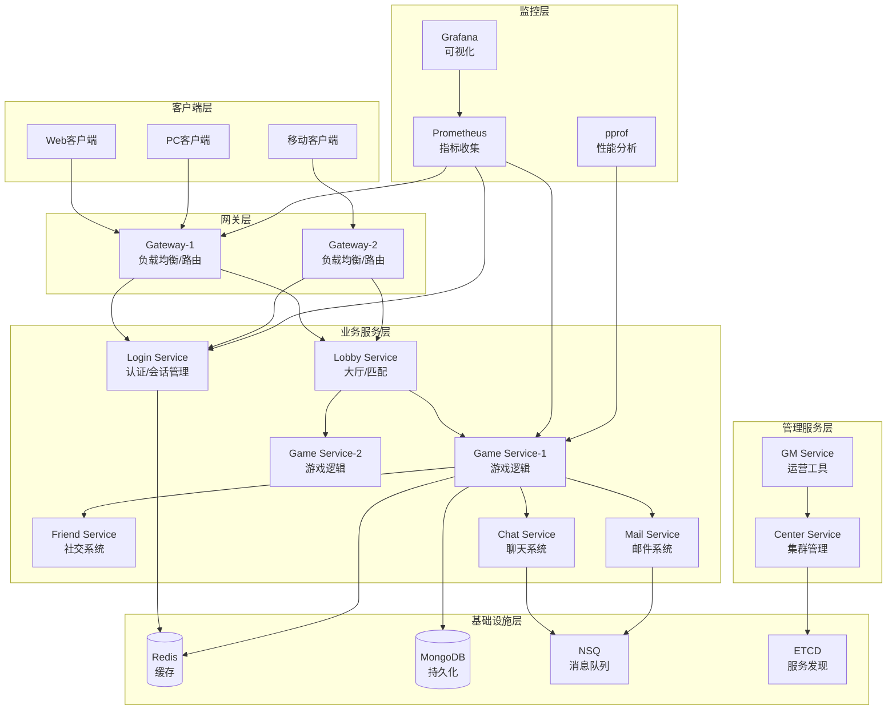

<div align="center">

# Lufy 🎮

**企业级分布式游戏服务器框架**

*专为卡牌和策略类游戏设计，基于 Actor 模型构建*

[](https://golang.org)
[](LICENSE)
[](https://github.com/phuhao00/lufy/stargazers)
[](https://github.com/phuhao00/lufy/network)

[](https://github.com/phuhao00/lufy)
[](https://github.com/phuhao00/lufy)
[](https://goreportcard.com/report/github.com/phuhao00/lufy)
[](https://hub.docker.com/r/phuhao00/lufy)

🚀 **高并发** • 🔒 **安全性** • 📊 **监控** • 🔥 **热更新** • 🌍 **国际化**

</div>

**Lufy** 基于 Actor 模型构建，提供高并发、安全性、监控和热更新能力，支持百万级并发连接。

## ✨ 核心特性

| 特性 | 描述 | 技术栈 |
|------|------|--------|
| 🏗️ **分布式架构** | Actor模型 + 微服务，支持横向扩展 | Go + ETCD + RPC |
| 🚀 **高性能网络** | 百万级并发连接，TCP + Protobuf | TCP/Protobuf/连接池 |
| 💾 **数据存储** | Redis集群 + MongoDB副本集 | Redis(6节点) + MongoDB(3节点) |
| 🔥 **热更新** | 配置/逻辑/插件动态更新 | Go Plugin + 版本控制 |
| 📊 **监控分析** | 实时指标 + 性能分析 | Prometheus + Grafana + pprof |
| 🔐 **安全防护** | JWT认证 + 反作弊 + 限流 | JWT + AES-GCM + 行为分析 |
| 🌍 **国际化** | 多语言 + 本地化格式 | i18n + 动态切换 |
| 🎮 **游戏框架** | 卡牌系统 + 房间管理 + AI | 模块化设计 |

## 📋 系统要求

| 组件 | 版本 | 用途 | 必需 |
|------|------|------|------|
| Go | 1.21+ | 运行时环境 | ✅ |
| Redis | 6.0+ | 缓存存储 | ✅ |
| MongoDB | 4.4+ | 数据持久化 | ✅ |
| ETCD | 3.5+ | 服务发现 | ✅ |
| NSQ | 1.2+ | 消息队列 | ✅ |
| Docker | Latest | 容器化部署 | 🔶 |

## 🏗️ 系统架构



**技术栈**: Go + Redis + MongoDB + ETCD + NSQ + Prometheus + Grafana + Docker

## 🎯 服务节点

| 服务 | RPC端口 | 监控端口 | 核心功能 |
|------|---------|----------|----------|
| Gateway | 9001-9002 | 7001-7002 | 客户端接入、负载均衡 |
| Login | 9020 | 7020 | 用户认证、会话管理 |
| Lobby | 9030 | 7030 | 房间管理、匹配系统 |
| Game | 9100-9102 | 7100-7102 | 游戏逻辑、AI系统 |
| Friend | 9040 | 7040 | 好友系统、社交功能 |
| Chat | 9050 | 7050 | 聊天系统、消息广播 |
| Mail | 9060 | 7060 | 邮件系统、奖励发放 |
| GM | 9200 | 7200 | 运营管理、热更新 |
| Center | 9010 | 7010 | 集群管理、监控统计 |

## 🚀 快速开始

### 1. 克隆项目

```bash
git clone https://github.com/phuhao00/lufy.git
cd lufy
```

### 2. 部署方式

| 方式 | 命令 | 适用场景 |
|------|------|----------|
| **Docker单机** | `docker-compose up -d` | 开发测试 |
| **集群部署** | `./scripts/start_cluster.sh` | 生产环境 |
| **本地开发** | `go mod tidy && make build && ./scripts/start.sh` | 本地调试 |

### 3. 验证部署

```bash
# 检查服务状态
./scripts/status.sh

# 测试客户端连接
go run examples/client/main.go
```

### 4. 监控面板

| 服务 | 地址 | 用途 |
|------|------|------|
| 主监控 | http://localhost:7001 | 服务状态 |
| Grafana | http://localhost:3000 | 可视化监控 |
| Prometheus | http://localhost:9090 | 指标查询 |

## ⚙️ 配置说明

主配置文件：`config/config.yaml`

```yaml
server:
  name: "lufy-game-server"
  debug: true

network:
  tcp_port: 8001
  rpc_port: 9001
  http_port: 7001

database:
  redis:
    addr: "127.0.0.1:6379"
  mongodb:
    uri: "mongodb://127.0.0.1:27017"
    database: "lufy_game"
```

## 🔥 热更新

支持配置、逻辑、数据的动态更新，无需重启服务。

```bash
# 重载配置
./scripts/hot_reload.sh config

# 重载游戏逻辑
./scripts/hot_reload.sh logic game

# 查看状态
./scripts/hot_reload.sh status
```

## 📊 监控与分析

**监控指标**: 在线用户数、QPS、响应时间、错误率、内存使用、Goroutine数量

**性能分析**:
```bash
# CPU/内存/协程分析
go tool pprof http://localhost:8080/debug/pprof/profile
go tool pprof http://localhost:8080/debug/pprof/heap
```


#### 1. **性能问题诊断**

**问题现象**：响应延迟高、CPU/内存使用率异常

**诊断工具**：
```bash
# 实时性能监控
go run tools/performance_analyzer.go watch

# CPU热点分析
go tool pprof http://localhost:8001/debug/pprof/profile?seconds=30

# 内存分析
go tool pprof http://localhost:8001/debug/pprof/heap

# Goroutine泄漏检测
go tool pprof http://localhost:8001/debug/pprof/goroutine

# 在pprof交互模式中：
(pprof) top 20           # 查看CPU热点
(pprof) list funcName    # 查看函数详情
(pprof) traces           # 查看调用栈
(pprof) web             # 生成可视化图表
```


#### 2. **内存泄漏排查**

```bash
# 1. 持续监控堆内存
watch -n 5 "go tool pprof -top http://localhost:8001/debug/pprof/heap"

# 2. 生成内存快照对比
go tool pprof -base heap1.pb.gz heap2.pb.gz

# 3. 查看对象池统计
curl http://localhost:7001/api/pool/stats

# 4. 检查Goroutine泄漏
go tool pprof http://localhost:8001/debug/pprof/goroutine
(pprof) top
(pprof) traces
```

## 🚀 部署案例

### 小型游戏部署（1-1万用户）

```yaml
# 推荐配置
services:
  gateway: 1个实例 (2核4GB)
  login: 1个实例 (1核2GB)
  game: 2个实例 (4核8GB)
  其他服务: 各1个实例 (1核2GB)

总资源需求: 16核32GB内存
```

### 中型游戏部署（1-10万用户）

```yaml
# 推荐配置
services:
  gateway: 3个实例 (4核8GB)
  login: 2个实例 (2核4GB)
  game: 5个实例 (8核16GB)
  friend/chat/mail: 各2个实例 (2核4GB)

总资源需求: 64核128GB内存
```

### 大型游戏部署（10万+用户）

```yaml
# 推荐配置
gateway: 
  instances: 5+
  resources: 8核16GB
  
game:
  instances: 10+
  resources: 16核32GB
  
数据库:
  redis_cluster: 6节点
  mongodb_replica: 3节点
  
监控:
  prometheus: 专用服务器
  grafana: 高可用部署
```

## 🛡️ 安全建议

### 生产环境安全检查清单

- [ ] 更改默认密码和密钥
- [ ] 启用HTTPS/TLS加密
- [ ] 配置防火墙规则
- [ ] 启用访问日志记录
- [ ] 定期更新依赖包
- [ ] 配置自动备份
- [ ] 启用监控告警
- [ ] 进行渗透测试
- [ ] 制定应急响应计划

### 安全配置模板

```yaml
# config/security.yaml
security:
  tls:
    enabled: true
    cert_file: "/certs/server.crt"
    key_file: "/certs/server.key"
  
  cors:
    allowed_origins: ["https://yourgame.com"]
    allowed_methods: ["GET", "POST"]
    allowed_headers: ["Authorization", "Content-Type"]
  
  rate_limiting:
    enabled: true
    global_limit: 10000
    per_ip_limit: 100
    burst_size: 10
  
  session:
    secure: true
    http_only: true
    same_site: "strict"
    max_age: 86400
```


```bash
git clone https://github.com/phuhao00/lufy.git
cd lufy
./scripts/start_enhanced.sh --with-monitoring
# 🎉 你的游戏服务器已经运行在 http://localhost:7001
```

---

<div align="center">

**⭐ 如果你觉得 Lufy 对你有帮助，请给我们一个 Star！ ⭐**

[](https://star-history.com/#phuhao00/lufy&Date)

**Made with ❤️ by the Lufy Team**

</div>
