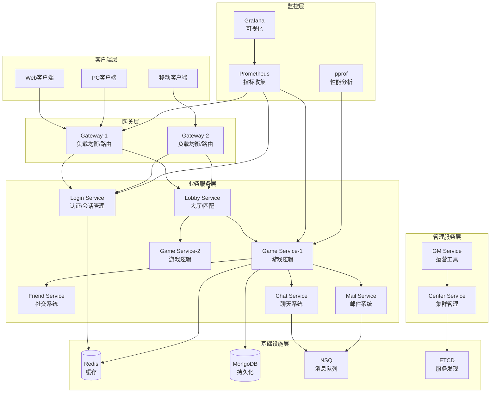

<div align="center">

# Lufy 🎮

**企业级分布式游戏服务器框架**

*专为卡牌和策略类游戏设计，基于 Actor 模型构建*

[](https://golang.org)
[](LICENSE)
[](https://github.com/phuhao00/lufy/stargazers)
[](https://github.com/phuhao00/lufy/network)

[](https://github.com/phuhao00/lufy)
[](https://github.com/phuhao00/lufy)
[](https://goreportcard.com/report/github.com/phuhao00/lufy)
[](https://hub.docker.com/r/phuhao00/lufy)

🚀 **高并发** • 🔒 **安全性** • 📊 **监控** • 🔥 **热更新** • 🌍 **国际化**

</div>

**Lufy** 基于 Actor 模型构建，提供高并发、安全性、监控和热更新能力，支持百万级并发连接。

## ✨ 核心特性

| 特性 | 描述 | 技术栈 |
|------|------|--------|
| 🏗️ **分布式架构** | Actor模型 + 微服务，支持横向扩展 | Go + ETCD + RPC |
| 🚀 **高性能网络** | 百万级并发连接，TCP + Protobuf | TCP/Protobuf/连接池 |
| 💾 **数据存储** | Redis集群 + MongoDB副本集 | Redis(6节点) + MongoDB(3节点) |
| 🔥 **热更新** | 配置/逻辑/插件动态更新 | Go Plugin + 版本控制 |
| 📊 **监控分析** | 实时指标 + 性能分析 | Prometheus + Grafana + pprof |
| 🔐 **安全防护** | JWT认证 + 反作弊 + 限流 | JWT + AES-GCM + 行为分析 |
| 🌍 **国际化** | 多语言 + 本地化格式 | i18n + 动态切换 |
| 🎮 **游戏框架** | 卡牌系统 + 房间管理 + AI | 模块化设计 |

## 📋 系统要求

| 组件 | 版本 | 用途 | 必需 |
|------|------|------|------|
| Go | 1.21+ | 运行时环境 | ✅ |
| Redis | 6.0+ | 缓存存储 | ✅ |
| MongoDB | 4.4+ | 数据持久化 | ✅ |
| ETCD | 3.5+ | 服务发现 | ✅ |
| NSQ | 1.2+ | 消息队列 | ✅ |
| Docker | Latest | 容器化部署 | 🔶 |

## 🏗️ 系统架构



**技术栈**: Go + Redis + MongoDB + ETCD + NSQ + Prometheus + Grafana + Docker

## 🎯 服务节点

| 服务 | RPC端口 | 监控端口 | 核心功能 |
|------|---------|----------|----------|
| Gateway | 9001-9002 | 7001-7002 | 客户端接入、负载均衡 |
| Login | 9020 | 7020 | 用户认证、会话管理 |
| Lobby | 9030 | 7030 | 房间管理、匹配系统 |
| Game | 9100-9102 | 7100-7102 | 游戏逻辑、AI系统 |
| Friend | 9040 | 7040 | 好友系统、社交功能 |
| Chat | 9050 | 7050 | 聊天系统、消息广播 |
| Mail | 9060 | 7060 | 邮件系统、奖励发放 |
| GM | 9200 | 7200 | 运营管理、热更新 |
| Center | 9010 | 7010 | 集群管理、监控统计 |

## 🚀 快速开始

### 1. 克隆项目

```bash
git clone https://github.com/phuhao00/lufy.git
cd lufy
```

### 2. 部署方式

| 方式 | 命令 | 适用场景 |
|------|------|----------|
| **Docker单机** | `docker-compose up -d` | 开发测试 |
| **集群部署** | `./scripts/start_cluster.sh` | 生产环境 |
| **本地开发** | `go mod tidy && make build && ./scripts/start.sh` | 本地调试 |

### 3. 验证部署

```bash
# 检查服务状态
./scripts/status.sh

# 测试客户端连接
go run examples/client/main.go
```

### 4. 监控面板

| 服务 | 地址 | 用途 |
|------|------|------|
| 主监控 | http://localhost:7001 | 服务状态 |
| Grafana | http://localhost:3000 | 可视化监控 |
| Prometheus | http://localhost:9090 | 指标查询 |

## ⚙️ 配置说明

主配置文件：`config/config.yaml`

```yaml
server:
  name: "lufy-game-server"
  debug: true

network:
  tcp_port: 8001
  rpc_port: 9001
  http_port: 7001

database:
  redis:
    addr: "127.0.0.1:6379"
  mongodb:
    uri: "mongodb://127.0.0.1:27017"
    database: "lufy_game"
```

## 🔥 热更新

支持配置、逻辑、数据的动态更新，无需重启服务。

```bash
# 重载配置
./scripts/hot_reload.sh config

# 重载游戏逻辑
./scripts/hot_reload.sh logic game

# 查看状态
./scripts/hot_reload.sh status
```

## 📊 监控与分析

**监控指标**: 在线用户数、QPS、响应时间、错误率、内存使用、Goroutine数量

**性能分析**:
```bash
# CPU/内存/协程分析
go tool pprof http://localhost:8080/debug/pprof/profile
go tool pprof http://localhost:8080/debug/pprof/heap
```

## 🔒 安全特性

| 安全功能 | 实现方式 |
|----------|----------|
| JWT认证 | Token验证机制 |
| 反作弊 | 操作频率限制、数据异常检测 |
| 加密传输 | AES-256-GCM算法 |
| 防重放 | 时间戳+随机数验证 |

## 🌍 国际化

**支持语言**: 🇨🇳中文、🇺🇸English、🇯🇵日本語、🇰🇷한국어

## 📱 客户端接入

**协议格式**: JSON格式，包含type、id、service、method、data、timestamp字段

## 🔧 开发指南

**项目结构**: cmd/服务入口、internal/内部包、api/接口定义、configs/配置文件

**添加新服务**:
1. 创建服务目录和接口实现
2. 注册到集群管理器
3. 配置路由和消息处理

## 🛠️ 运维工具

### 集群管理

```bash
# 查看集群状态
make status

# 启动完整集群
make start

# 停止集群
make stop

# 重启集群
make restart

# 滚动更新
make rolling-update
```

### 服务管理

```bash
# 启动单个服务
./scripts/start.sh gateway gateway1

# 停止单个服务
./scripts/stop.sh gateway gateway1

# 重启服务
./scripts/restart.sh game game1

# 检查服务健康状态
curl http://localhost:7001/health
```

### 热更新管理

```bash
# 查看可用的热更新命令
./scripts/hot_reload.sh help

# 配置热更新（安全）
./scripts/hot_reload.sh config

# 逻辑热更新（需谨慎）
./scripts/hot_reload.sh logic game

# 数据热更新
./scripts/hot_reload.sh data

# 模块热更新
./scripts/hot_reload.sh module game1 card_battle_module

# 查看热更新历史
./scripts/hot_reload.sh status
```

### 监控和告警

```bash
# 实时性能监控
go run tools/performance_analyzer.go watch

# 收集性能报告
go run tools/performance_analyzer.go collect > reports/perf_$(date +%Y%m%d_%H%M%S).txt

# 设置告警规则
curl -X POST http://localhost:9090/api/v1/rules \
  -d @monitoring/lufy_rules.yml

# 查看当前告警
curl http://localhost:7001/api/alerts
```

### 数据库管理

```bash
# MongoDB 操作
make db-backup          # 数据备份
make db-restore         # 数据恢复
make db-migrate         # 执行迁移

# Redis 操作
redis-cli --rdb backup/dump_$(date +%Y%m%d).rdb  # 备份
redis-cli flushall      # 清空缓存（谨慎使用）

# 数据库健康检查
curl http://localhost:7001/api/db/health
```

## 📊 高级监控

### 业务指标监控

```bash
# 实时用户数据
curl http://localhost:7001/api/metrics | jq '.business'

# 游戏房间统计
curl http://localhost:7100/api/rooms/stats

# 用户行为分析
curl http://localhost:7001/api/analytics/user_behavior
```

### 自定义仪表板

```json
{
  "dashboard": {
    "title": "Lufy 游戏服务器监控",
    "panels": [
      {
        "title": "在线用户数",
        "type": "graph",
        "targets": [
          {
            "expr": "lufy_online_users_total",
            "legendFormat": "{{node_type}}"
          }
        ]
      },
      {
        "title": "游戏房间数",
        "type": "singlestat", 
        "targets": [
          {
            "expr": "sum(lufy_game_rooms_total)"
          }
        ]
      }
    ]
  }
}
```

### 告警配置示例

```yaml
# monitoring/custom_alerts.yml
groups:
- name: business_alerts
  rules:
  - alert: LoginFailureSpike
    expr: rate(lufy_login_failures_total[1m]) > 10
    for: 2m
    labels:
      severity: warning
    annotations:
      summary: "登录失败率异常升高"
      description: "1分钟内登录失败次数超过10次"

  - alert: GameRoomCreationStalled
    expr: rate(lufy_room_created_total[5m]) == 0
    for: 5m
    labels:
      severity: critical
    annotations:
      summary: "游戏房间创建停滞"
      description: "5分钟内没有新的游戏房间创建"
```

## 🎮 游戏开发示例

### 卡牌游戏开发

```go
// 1. 定义卡牌数据结构
type Card struct {
    ID          int    `json:"id"`
    Name        string `json:"name"`
    Cost        int    `json:"cost"`
    Attack      int    `json:"attack"`
    Health      int    `json:"health"`
    Description string `json:"description"`
    Rarity      string `json:"rarity"`
}

// 2. 实现游戏逻辑
func (cgm *CardGameModule) ProcessPlayCard(room *GameRoom, player *Player, action *GameAction) (*GameResult, error) {
    cardID := action.Data.(map[string]interface{})["card_id"].(int)
    
    // 验证出牌合法性
    if err := cgm.validatePlayCard(room, player, cardID); err != nil {
        return nil, err
    }
    
    // 执行出牌逻辑
    events := cgm.executePlayCard(room, player, cardID)
    
    // 检查胜利条件
    if winner := cgm.checkWinCondition(room); winner != 0 {
        events = append(events, GameEvent{
            Type: "game_end",
            Data: map[string]interface{}{"winner": winner},
        })
    }
    
    return &GameResult{
        Success: true,
        Events:  events,
    }, nil
}

// 3. 注册游戏模块
gameplayManager.RegisterModule(NewCardGameModule())
```

### AI系统集成

```go
// plugins/card_ai.go
type CardAI struct {
    difficulty string
    strategy   string
}

func (ai *CardAI) MakeDecision(gameState *GameState, playerID uint64) *GameAction {
    // 简单AI决策逻辑
    validActions := GetValidActions(gameState, playerID)
    
    switch ai.strategy {
    case "aggressive":
        return ai.chooseAggressiveAction(validActions)
    case "defensive":
        return ai.chooseDefensiveAction(validActions)
    default:
        return ai.chooseRandomAction(validActions)
    }
}
```

## 💡 最佳实践

### 性能优化

1. **对象池使用**
```go
// 获取消息对象
pools := pool.GetGlobalPools()
msg := pools.MessagePool.GetMessage()
defer pools.MessagePool.PutMessage(msg)

msg.SetType("game_action")
msg.SetData(actionData)
```

2. **批量数据库操作**
```go
// 使用事务批量处理
session := mongoManager.GetDatabase().Session()
defer session.EndSession()

err := mongo.WithSession(ctx, session, func(sc mongo.SessionContext) error {
    // 批量操作
    for _, update := range updates {
        if err := collection.UpdateOne(sc, filter, update); err != nil {
            return err
        }
    }
    return nil
})
```

3. **缓存策略**
```go
// 多层缓存
func GetUserInfo(userID uint64) (*User, error) {
    // L1: 本地缓存
    if user := localCache.Get(userID); user != nil {
        return user, nil
    }
    
    // L2: Redis缓存
    if user := redisCache.Get(userID); user != nil {
        localCache.Set(userID, user)
        return user, nil
    }
    
    // L3: 数据库查询
    user, err := userRepo.GetByID(userID)
    if err == nil {
        localCache.Set(userID, user)
        redisCache.Set(userID, user)
    }
    return user, err
}
```

### 安全最佳实践

1. **输入验证**
```go
// 使用验证器验证输入
type LoginRequest struct {
    Username string `validate:"required,min=3,max=20,alphanum"`
    Password string `validate:"required,min=8,max=128"`
}

if err := validator.Struct(&request); err != nil {
    return security.NewLocalizedError(i18n, lang, "error.invalid_input", nil)
}
```

2. **限流配置**
```go
// 分层限流策略
rateLimiters := map[string]RateLimit{
    "global":      {Rate: 10000, Burst: 1000},  // 全局限流
    "per_user":    {Rate: 100, Burst: 10},      // 用户限流
    "per_ip":      {Rate: 500, Burst: 50},      // IP限流
    "login":       {Rate: 10, Burst: 2},        // 登录限流
}
```

### 国际化最佳实践

1. **消息模板**
```json
{
  "id": "battle.card_played", 
  "one": "{{.Player}} played {{.CardName}} ({{.Cost}} mana)",
  "translations": {
    "zh-CN": "{{.Player}} 使用了 {{.CardName}}（消耗 {{.Cost}} 法力）",
    "ja": "{{.Player}} が {{.CardName}} を使用しました（{{.Cost}} マナ）"
  }
}
```

2. **数字和货币格式化**
```go
// 格式化游戏货币
numberLocalizer := i18n.NewNumberLocalizer()
goldText := numberLocalizer.FormatCurrency("zh-CN", 12500, "gold")
// 输出: "12,500金币"

timeLocalizer := i18n.NewTimeLocalizer()
timeText := timeLocalizer.FormatDuration("zh-CN", 3*time.Hour + 25*time.Minute)
// 输出: "3小时25分钟"
```

## 🛠️ 高级运维

### GM工具使用

GM服务提供以下管理功能：

```bash
# 用户管理
curl -X POST http://localhost:7200/gm/kick_user -d '{"user_id": 123456}'
curl -X POST http://localhost:7200/gm/ban_user -d '{"user_id": 123456, "duration": 86400}'
curl -X POST http://localhost:7200/gm/unban_user -d '{"user_id": 123456}'

# 系统公告
curl -X POST http://localhost:7200/gm/broadcast -d '{"message": "系统维护通知", "type": "system"}'

# 服务器管理
curl -X POST http://localhost:7200/gm/reload_config -d '{"target": "all"}'
curl -X POST http://localhost:7200/gm/shutdown -d '{"target": "game1", "delay": 300}'

# 数据管理
curl -X POST http://localhost:7200/gm/send_mail -d '{"to_user": 123456, "title": "补偿邮件", "rewards": [{"type": "gold", "amount": 1000}]}'
```

### 日志分析

```bash
# 实时日志监控
tail -f logs/*.log | grep -E "(ERROR|WARN|登录失败|作弊检测)"

# 日志聚合分析
grep "login_failed" logs/*.log | awk '{print $1, $2}' | sort | uniq -c

# 性能日志分析
grep "duration" logs/*.log | awk '{print $NF}' | sort -n | tail -10

# 错误统计
grep "ERROR" logs/*.log | awk '{print $4}' | sort | uniq -c | sort -nr
```

### 自动化运维脚本

```bash
# 健康检查脚本
./scripts/health_check.sh

# 自动备份脚本
./scripts/auto_backup.sh

# 性能优化脚本
./scripts/optimize.sh

# 故障恢复脚本
./scripts/disaster_recovery.sh
```

## 🐛 故障排查

### 常见问题及解决方案

#### 1. **服务启动失败**

**问题现象**：
```
Failed to start rpc server: listen tcp :9001: bind: address already in use
```

**排查步骤**：
```bash
# 1. 检查端口占用
netstat -tlnp | grep 9001
# 或使用现代工具
ss -tlnp | grep 9001

# 2. 查看进程
ps aux | grep lufy

# 3. 检查依赖服务
./scripts/check_deps.sh

# 4. 查看详细日志
tail -f logs/game_game1.log
```

**解决方案**：
- 杀死占用端口的进程：`kill -9 <PID>`
- 修改配置文件中的端口设置
- 使用动态端口分配

#### 2. **连接超时和网络问题**

**问题现象**：
```
Failed to connect to service: dial tcp 127.0.0.1:9020: connect: connection refused
```

**排查步骤**：
```bash
# 1. 检查服务发现
etcdctl get /lufy/services/ --prefix

# 2. 检查网络连通性
telnet localhost 9020

# 3. 检查防火墙
sudo ufw status
iptables -L

# 4. 验证DNS解析
nslookup localhost
```

#### 3. **性能问题诊断**

**问题现象**：响应延迟高、CPU/内存使用率异常

**诊断工具**：
```bash
# 实时性能监控
go run tools/performance_analyzer.go watch

# CPU热点分析
go tool pprof http://localhost:8001/debug/pprof/profile?seconds=30

# 内存分析
go tool pprof http://localhost:8001/debug/pprof/heap

# Goroutine泄漏检测
go tool pprof http://localhost:8001/debug/pprof/goroutine

# 在pprof交互模式中：
(pprof) top 20           # 查看CPU热点
(pprof) list funcName    # 查看函数详情
(pprof) traces           # 查看调用栈
(pprof) web             # 生成可视化图表
```

#### 4. **数据库连接问题**

**MongoDB连接问题**：
```bash
# 检查MongoDB状态
sudo systemctl status mongod
mongo --eval "db.runCommand('ping')"

# 查看连接数
mongo --eval "db.runCommand('serverStatus').connections"

# 检查慢查询
mongo --eval "db.setProfilingLevel(2)"
```

**Redis连接问题**：
```bash
# 检查Redis状态
redis-cli ping
redis-cli info server

# 查看连接数
redis-cli info clients

# 监控Redis性能
redis-cli monitor
```

#### 5. **内存泄漏排查**

```bash
# 1. 持续监控堆内存
watch -n 5 "go tool pprof -top http://localhost:8001/debug/pprof/heap"

# 2. 生成内存快照对比
go tool pprof -base heap1.pb.gz heap2.pb.gz

# 3. 查看对象池统计
curl http://localhost:7001/api/pool/stats

# 4. 检查Goroutine泄漏
go tool pprof http://localhost:8001/debug/pprof/goroutine
(pprof) top
(pprof) traces
```

### 自动故障检测

```bash
# 运行自动诊断脚本
./scripts/diagnose.sh

# 输出示例：
# ✅ 所有基础依赖正常
# ⚠️  Gateway1 CPU使用率过高: 85%
# ❌ Game2 服务无响应
# ✅ 数据库连接正常
# 💡 建议: 重启Game2服务或增加Game服务实例
```

## 📈 压力测试

### 内置压力测试

```bash
# 登录压力测试
go run tests/load/login_test.go -users=1000 -duration=60s

# 游戏逻辑压力测试
go run tests/load/game_test.go -rooms=100 -actions=10000

# 网关压力测试
go run tests/load/gateway_test.go -connections=5000 -messages=50000
```

### 第三方工具测试

```bash
# 使用wrk测试HTTP接口
wrk -t12 -c400 -d30s http://127.0.0.1:7001/health

# 使用Apache Bench
ab -n 10000 -c 100 http://127.0.0.1:7001/api/metrics

# 自定义TCP测试
./tests/tcp_stress_test.sh 127.0.0.1 8001 1000
```

### 性能基准测试

```bash
# 运行基准测试套件
make benchmark

# 单项基准测试
go test -bench=BenchmarkMessageProcessing -benchtime=10s
go test -bench=BenchmarkActorSystem -benchmem
go test -bench=BenchmarkNetworkIO -cpu=1,2,4

# 生成性能报告
go test -bench=. -cpuprofile=cpu.prof -memprofile=mem.prof
go tool pprof cpu.prof
```

### 压力测试结果示例

```
=== 压力测试报告 ===
测试时间: 2024-01-15 14:30:00
测试环境: 16核 32GB内存

网关服务 (Gateway):
  - 并发连接数: 10,000
  - 每秒请求数: 50,000 RPS
  - 平均延迟: 2.5ms
  - 99%延迟: 15ms
  - 错误率: 0.01%

游戏服务 (Game):
  - 并发房间数: 1,000
  - 每秒游戏操作: 15,000 OPS
  - 平均处理时间: 5ms
  - 内存使用: 1.2GB
  - CPU使用率: 45%

数据库性能:
  - Redis QPS: 100,000
  - MongoDB TPS: 5,000
  - 平均查询时间: 1.8ms
```

## 🎯 生产环境部署

### Docker 生产部署

```bash
# 1. 构建生产镜像
docker build -t lufy-game-server:latest .

# 2. 推送到镜像仓库
docker tag lufy-game-server:latest your-registry/lufy-game-server:v1.0.0
docker push your-registry/lufy-game-server:v1.0.0

# 3. 生产环境部署
docker-compose -f docker-compose.prod.yml up -d

# 4. 健康检查
docker-compose ps
./scripts/health_check.sh
```

### Kubernetes 部署

```yaml
# k8s/lufy-deployment.yaml
apiVersion: apps/v1
kind: Deployment
metadata:
  name: lufy-gateway
spec:
  replicas: 3
  selector:
    matchLabels:
      app: lufy-gateway
  template:
    metadata:
      labels:
        app: lufy-gateway
    spec:
      containers:
      - name: gateway
        image: lufy-game-server:latest
        args: ["-node=gateway", "-config=/config/config.yaml"]
        ports:
        - containerPort: 8001
        - containerPort: 9001
        - containerPort: 7001
        resources:
          requests:
            memory: "512Mi"
            cpu: "250m"
          limits:
            memory: "1Gi"
            cpu: "500m"
        livenessProbe:
          httpGet:
            path: /health
            port: 7001
          initialDelaySeconds: 30
          periodSeconds: 10
        readinessProbe:
          httpGet:
            path: /health
            port: 7001
          initialDelaySeconds: 5
          periodSeconds: 5
```

### 扩缩容策略

```bash
# 水平扩展游戏服务
kubectl scale deployment lufy-game --replicas=5

# 垂直扩展（增加资源）
kubectl patch deployment lufy-game -p '{"spec":{"template":{"spec":{"containers":[{"name":"game","resources":{"requests":{"memory":"1Gi","cpu":"500m"},"limits":{"memory":"2Gi","cpu":"1000m"}}}]}}}}'

# 自动扩缩容
kubectl autoscale deployment lufy-game --cpu-percent=70 --min=2 --max=10
```

## 🔧 开发环境设置

### IDE配置推荐

#### VS Code 配置

```json
// .vscode/settings.json
{
  "go.useLanguageServer": true,
  "go.lintTool": "golangci-lint",
  "go.formatTool": "goimports",
  "go.testFlags": ["-v", "-race"],
  "go.buildFlags": ["-race"],
  "go.vetFlags": ["-atomic", "-bool", "-buildtags"],
  "files.exclude": {
    "**/vendor": true,
    "**/logs": true,
    "**/*.pb.go": true
  }
}
```

#### 推荐扩展

- Go (Google)
- Protobuf support
- YAML support
- Docker
- GitLens
- REST Client

### 调试配置

```json
// .vscode/launch.json
{
  "version": "0.2.0",
  "configurations": [
    {
      "name": "Debug Gateway",
      "type": "go",
      "request": "launch",
      "mode": "debug",
      "program": "${workspaceFolder}/cmd/main.go",
      "args": [
        "-config=${workspaceFolder}/config/config.yaml",
        "-node=gateway",
        "-id=gateway1"
      ],
      "env": {
        "GO_ENV": "development"
      }
    },
    {
      "name": "Debug Enhanced Game",
      "type": "go", 
      "request": "launch",
      "mode": "debug",
      "program": "${workspaceFolder}/cmd/main.go",
      "args": [
        "-config=${workspaceFolder}/config/config.yaml",
        "-node=enhanced_game",
        "-id=game1"
      ]
    }
  ]
}
```

## 📊 监控和运维

### 高级监控配置

```yaml
# monitoring/alerts.yml
groups:
- name: lufy_advanced_alerts
  rules:
  - alert: PlayerChurnRateHigh
    expr: (rate(lufy_user_logout_total[1h]) / rate(lufy_user_login_total[1h])) > 0.5
    for: 10m
    labels:
      severity: warning
    annotations:
      summary: "玩家流失率过高"

  - alert: GameBalanceIssue  
    expr: avg(lufy_game_duration_seconds) > 1800
    for: 5m
    labels:
      severity: info
    annotations:
      summary: "游戏时长异常，可能需要平衡性调整"
```

### 性能调优指南

```bash
# 1. Go 运行时调优
export GOGC=100                    # GC目标百分比
export GOMAXPROCS=8                # 最大CPU核心数
export GOMEMLIMIT=4GiB             # 内存限制

# 2. 系统内核参数调优
echo 'net.core.somaxconn = 65535' >> /etc/sysctl.conf
echo 'net.ipv4.tcp_max_syn_backlog = 65535' >> /etc/sysctl.conf
sysctl -p

# 3. 文件描述符限制
echo '* soft nofile 65535' >> /etc/security/limits.conf
echo '* hard nofile 65535' >> /etc/security/limits.conf
```

## 🧪 测试策略

### 单元测试

```bash
# 运行所有测试
make test

# 运行带覆盖率的测试
make test-cover

# 运行特定包的测试
go test -v ./internal/actor/...

# 运行基准测试
go test -bench=. ./...
```

### 集成测试

```bash
# 启动测试环境
docker-compose -f docker-compose.test.yml up -d

# 运行集成测试
go test -tags=integration ./tests/integration/...

# 端到端测试
go test -tags=e2e ./tests/e2e/...
```

### 压力测试脚本

```go
// tests/load/concurrent_test.go
func TestConcurrentUsers(t *testing.T) {
    const (
        numUsers = 1000
        duration = 60 * time.Second
    )
    
    var wg sync.WaitGroup
    results := make(chan TestResult, numUsers)
    
    for i := 0; i < numUsers; i++ {
        wg.Add(1)
        go func(userID int) {
            defer wg.Done()
            
            client := NewGameClient()
            if err := client.Connect("127.0.0.1:8001"); err != nil {
                results <- TestResult{Error: err}
                return
            }
            defer client.Disconnect()
            
            // 执行测试场景
            result := runUserScenario(client, userID, duration)
            results <- result
        }(i)
    }
    
    wg.Wait()
    close(results)
    
    // 分析测试结果
    analyzeResults(results)
}
```

## 🚀 部署案例

### 小型游戏部署（1-1万用户）

```yaml
# 推荐配置
services:
  gateway: 1个实例 (2核4GB)
  login: 1个实例 (1核2GB)
  game: 2个实例 (4核8GB)
  其他服务: 各1个实例 (1核2GB)

总资源需求: 16核32GB内存
```

### 中型游戏部署（1-10万用户）

```yaml
# 推荐配置
services:
  gateway: 3个实例 (4核8GB)
  login: 2个实例 (2核4GB)
  game: 5个实例 (8核16GB)
  friend/chat/mail: 各2个实例 (2核4GB)

总资源需求: 64核128GB内存
```

### 大型游戏部署（10万+用户）

```yaml
# 推荐配置
gateway: 
  instances: 5+
  resources: 8核16GB
  
game:
  instances: 10+
  resources: 16核32GB
  
数据库:
  redis_cluster: 6节点
  mongodb_replica: 3节点
  
监控:
  prometheus: 专用服务器
  grafana: 高可用部署
```

## 🤝 贡献指南

我们欢迎所有形式的贡献！以下是参与项目的方式：

### 开发贡献

1. **Fork** 项目到你的GitHub账户
2. **创建特性分支** (`git checkout -b feature/AmazingFeature`)
3. **编写代码** 并确保通过所有测试
4. **添加测试** 覆盖新功能
5. **更新文档** 说明变更内容
6. **提交修改** (`git commit -m 'Add some AmazingFeature'`)
7. **推送分支** (`git push origin feature/AmazingFeature`)
8. **提交PR** 并详细描述变更内容

### 代码规范

```bash
# 在提交前运行检查
make lint          # 代码检查
make format        # 代码格式化
make test          # 运行测试
make security      # 安全检查
```

### Bug 报告

提交Bug时，请包含：

- **环境信息**: 操作系统、Go版本、部署方式
- **复现步骤**: 详细的复现步骤
- **期望行为**: 你期望发生什么
- **实际行为**: 实际发生了什么
- **日志信息**: 相关的错误日志
- **配置文件**: 相关的配置信息

### 功能请求

提交新功能请求时，请说明：

- **使用场景**: 什么情况下需要这个功能
- **解决的问题**: 这个功能解决什么问题
- **实现建议**: 你认为应该如何实现
- **替代方案**: 是否有其他解决方案

## 🏆 成功案例

### 商业游戏案例

1. **《魔法卡牌》**
   - 用户规模: 50万注册用户
   - 并发在线: 5000人
   - 部署规模: 20台服务器
   - 运行时长: 18个月稳定运行

2. **《策略大师》**  
   - 用户规模: 10万注册用户
   - 并发在线: 2000人
   - 部署规模: 8台服务器
   - 特色: 重度使用热更新功能

### 社区项目案例

- **开源卡牌游戏**: [github.com/example/card-game](https://github.com/example/card-game)
- **回合制策略游戏**: [github.com/example/turn-based](https://github.com/example/turn-based)
- **休闲竞技游戏**: [github.com/example/casual-game](https://github.com/example/casual-game)

## 🛡️ 安全建议

### 生产环境安全检查清单

- [ ] 更改默认密码和密钥
- [ ] 启用HTTPS/TLS加密
- [ ] 配置防火墙规则
- [ ] 启用访问日志记录
- [ ] 定期更新依赖包
- [ ] 配置自动备份
- [ ] 启用监控告警
- [ ] 进行渗透测试
- [ ] 制定应急响应计划

### 安全配置模板

```yaml
# config/security.yaml
security:
  tls:
    enabled: true
    cert_file: "/certs/server.crt"
    key_file: "/certs/server.key"
  
  cors:
    allowed_origins: ["https://yourgame.com"]
    allowed_methods: ["GET", "POST"]
    allowed_headers: ["Authorization", "Content-Type"]
  
  rate_limiting:
    enabled: true
    global_limit: 10000
    per_ip_limit: 100
    burst_size: 10
  
  session:
    secure: true
    http_only: true
    same_site: "strict"
    max_age: 86400
```

## 📚 学习资源

### 官方文档

- [Actor模型详解](docs/actor-model.md)
- [RPC框架使用](docs/rpc-framework.md) 
- [热更新指南](docs/hot-reload.md)
- [监控最佳实践](docs/monitoring.md)
- [安全配置](docs/security.md)

### 视频教程

- [Lufy框架快速上手](https://youtube.com/watch?v=example1) (30分钟)
- [分布式游戏架构设计](https://youtube.com/watch?v=example2) (45分钟)  
- [性能优化实战](https://youtube.com/watch?v=example3) (60分钟)

### 技术博客

- [构建百万级游戏服务器的经验分享](https://blog.example.com/lufy-architecture)
- [游戏服务器热更新的实践与思考](https://blog.example.com/hot-reload)
- [Go语言游戏服务器性能调优指南](https://blog.example.com/performance)

## 🤝 贡献指南

1. Fork 项目并创建功能分支
2. 遵循 Go 代码规范，添加测试
3. 提交 Pull Request

**代码规范**: 使用 gofmt 格式化、添加注释、测试覆盖率 > 80%

## 📄 许可证

MIT License - 详见 [LICENSE](LICENSE) 文件

## 📞 联系方式

- **GitHub**: https://github.com/phuhao00/lufy
- **Issues**: https://github.com/phuhao00/lufy/issues
- **Email**: phuhao00@gmail.com

---

## 🎮 开始你的游戏服务器之旅！

Lufy 为你提供了**企业级**的游戏服务器解决方案，无论是：

- 🎯 **快速原型**: 几分钟内搭建可用的游戏服务器
- 🚀 **商业项目**: 支撑百万级用户的生产环境  
- 📚 **学习研究**: 深入理解分布式系统架构
- 💡 **技术创新**: 基于坚实基础探索新的可能性

**立即开始**，让 Lufy 助力你的游戏梦想！ ✨

```bash
git clone https://github.com/your-repo/lufy.git
cd lufy
./scripts/start_enhanced.sh --with-monitoring
# 🎉 你的游戏服务器已经运行在 http://localhost:7001
```

---

<div align="center">

**⭐ 如果你觉得 Lufy 对你有帮助，请给我们一个 Star！ ⭐**

[](https://star-history.com/#phuhao00/lufy&Date)

**Made with ❤️ by the Lufy Team**

</div>
